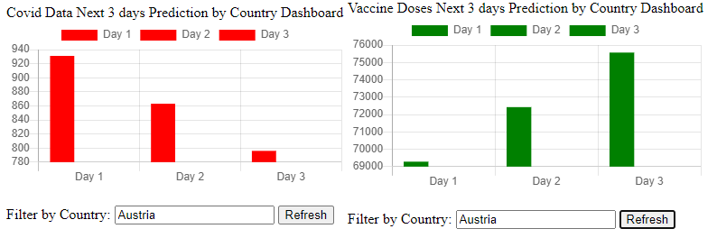

===================================
Regression Model
===================================

The data visualization is extended through another layer of linear regression model live execution
and projects next three days of expected Covid cases and Vaccine data.  The idea here is to provide an
outlet of models integration.  I plan to leverage machine learning models to interpret the data
and provide deeper actionable insights.

.. code-block::

    def linear_reg_predict(data):
        """
        Perform linear regression model execution and return the predicted values
        :param data: data sequence (covid or vaccine data for given country)
        :return:
            The generated predicted values for the next few days
        """

        lin_reg = LinearRegression()
        lin_reg.fit(X, y)

        predicted_y = lin_reg.predict(to_predict_x)
        m = lin_reg.coef_
        c = lin_reg.intercept_
        print("Predicted y:\n", predicted_y)
        print("slope (m): ", m)
        print("y-intercept (c): ", c)
        day1 = [round(num) for num in predicted_y[0]][0]
        day2 = [round(num) for num in predicted_y[1]][0]
        day3 = [round(num) for num in predicted_y[2]][0]
        rounded_predict = [day1, day2, day3]

        return rounded_predict

The data is visualized using Django app and chart JS

